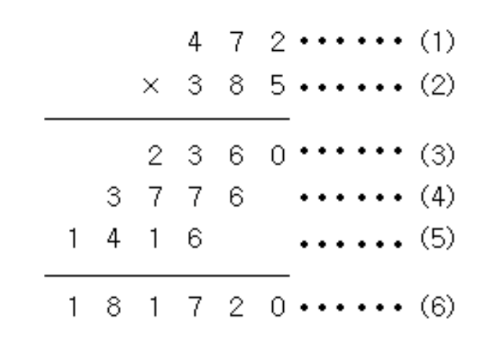

## 우리가 해야 할 것
### 1. 문제를 읽고, 요구 사항을 이해한다.

=> 문제를 정확하게 이해했다면, 어떤 프로그램을 만들어야 하는지 알 수 있을 것.

### 2. 요구 사항을 만족할 수 있는 방법을 고민하기.

=> 예를 들면, "위 문제의 경우에는 하나의 수와 각 자리수를 곱해야 하므로, 각 자리수를 분리하는 방법에 대해 생각해 봐야겠구나" 같은 생각들을 정리한다.

### 3. 내가 생각한 풀이를 단계로 나누어서 주석으로 옮겨 보기 (필수적인 건 아님)


```python
# 1. 두 개의 숫자를 입력 받는다.
number1 = int(input())# 2-2) 십의자리 뽑기
number2 = int(input())

# 2. 아래의 숫자를 백의자리, 십의자리, 일의자리로 구분한다.

# 2-1) 일의자리 뽑기

# 2-2) 십의자리 뽑기

# 2-3) 백의자리 뽑기

# 3. 각 자릿수 출력하기
```